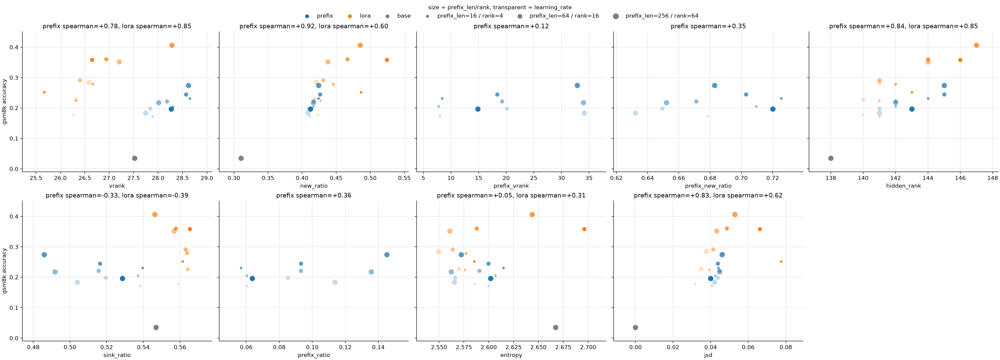

# vrank vs attn

## 배경

[ReasonCache](https://arxiv.org/pdf/2602.02366) 논문에서는 lora가 입력의 rank에 묶이는 carrier bottleneck이라는 구조적 한계 때문에 vrank에 상한이 있는 반면, prefix tuning은 prefix value가 base 모델이 쓰지 않던 새로운 방향을 어텐션의 value에 더해 vrank를 높일 수 있어 이러한 vrank 관점에서 lora보다 표현력이 크다고 주장. 그리고 reasoning 평가(gsm8k, math, gpqa 등)에서 prefix tuning이 lora를 넘거나 비슷함을 보이며, 이를 앞서 말한 vrank 표현력으로 설명.

허나 vrank가 실제 성능과 연결되는지는 확인하지 않았으며, 표현력에서 중요한 축이자 논문에서도 언급된 어텐션 패턴은 측정하지도 않음. 따라서 prefix가 실제로 lora보다 vrank라는 표현력을 키우는지, 그 표현력이 성능 차이로 이어지는지, 그리고 어텐션 패턴은 어떤지 확인.

## 실험 설정

모델은 논문의 llama-2와 같은 계열인 llama-3.2-1b를 사용. 학습 데이터는 metamathqa 중 gsm 유형으로 32768개를 사용. 측정용 데이터는 같은 gsm 유형에서 학습에는 사용하지 않고 변형된 중복이 아닌 256개로 측정. 평가는 gsm8k test 1319개에서 제로샷으로 진행.

prefix tuning 구현은 논문을 따라 mlp 재파라미터화를 이용하고 학습 데이터의 question으로 초기화하며 prefix_len 16/64/256으로 스윕. lora는 q/k/v_proj에만 적용해 rank 4/16/64로 스윕. 두 방법 모두 AdamW(weight decay 0), cosine 스케줄(warmup 0.05), epoch 3, batch 128, max_seq_len 2048, lr 1e-4/3e-4/1e-3/3e-3으로 스윕하되, prefix tuning은 3e-3에서 발산해 prefix_len 16에서만 돌리고 prefix_len 256에는 2e-3을 추가.

value 공간은 vrank, new_ratio, prefix_vrank, prefix_new_ratio, hidden_rank로 측정. vrank는 논문을 따라 각 레이어 v_proj 출력인 value를 헤드별로 보아, 특이값 제곱 누적 합이 90%를 채우는 방향 수로 정의. new_ratio는 같은 샘플에서 base의 주요 방향 밖에 있는 성분의 norm 비율로, 학습으로 새로운 방향이 얼마나 생겼는지를 의미. 이때 둘 다 샘플별로 쓰는 방향이 다르므로 샘플별로 따로 구하고 평균. 모든 레이어에서 구하되, 그림에서는 논문을 따라 마지막 레이어만 봄. prefix tuning에서는 prefix value만 따로 떼어 prefix_vrank와 prefix_new_ratio 측정. hidden_rank는 샘플별로 lm_head 직전 hidden의 특이값을 정규화해 평균한 뒤 누적 합이 90%를 채우는 방향 수로, 새롭게 생긴 방향들이 마지막까지 이어지는지 보기 위함.

어텐션 패턴은 entropy, jsd, sink_ratio, prefix_ratio로 측정. 모두 전 레이어와 헤드에 걸친 평균. entropy는 sink와 prefix를 제외한 입력 토큰에 대한 어텐션을 다시 정규화해 구한 entropy로, base와 비교해 달라졌다면 어텐션 패턴이 바뀐 것. jsd는 위치를 고려하지 않는 entropy와 달리, base와 위치별 분포가 얼마나 다른지를 확인. sink_ratio는 sink로 가는 어텐션 비율로, prefix tuning에서는 prefix 앞의 sink와 입력 bos를 합쳐 sink로 봄. prefix_ratio는 prefix로 가는 어텐션 비율.

## 결과

llama-3.2-1b 기준. base 정확도 3.5%. 발산해 base 이하로 떨어진 lora rank 64 lr 3e-3과 prefix tuning prefix_len 16 lr 3e-3 run은 제외.

성능은 lora가 최대 40.6%, prefix tuning이 최대 27.4%로 lora가 확연히 높아, 논문의 결과는 재현되지 않음.

vrank는 prefix tuning이 27.7~28.7로 base(27.5)보다 높고 lora(25.7~28.3)보다도 대체로 높음. 또한 prefix tuning spearman +0.78, lora spearman +0.85로 각 방법 안에서 정확도와 상관이 있음. 다만 vrank가 더 높은 prefix tuning이 정확도는 낮아, vrank의 효과가 방법 간 성능 차이를 이겨낼 정도는 아님.

prefix_new_ratio가 0.63~0.73으로, prefix는 논문대로 base가 쓰지 않던 새로운 방향을 value에 더함을 확인. 하지만 새로운 방향이 정확도로 이어지지는 않음. prefix_vrank는 불안정했던 prefix_len 256 lr 2e-3을 제외하면 prefix_len을 따라 커질 뿐 정확도와는 딱히 상관이 없고, 같은 lr에서 prefix_len을 키우면 정확도는 대체로 오르지만 prefix_new_ratio는 오히려 줄어듦.

논문은 prefix tuning의 hidden_rank가 가장 높다고 했지만, 여기서는 lora 최대 147, prefix tuning 최대 145로 lora가 더 높음.

hidden_rank는 prefix tuning spearman +0.84, lora spearman +0.85, jsd는 prefix tuning spearman +0.83, lora spearman +0.62로 정확도와 어느 정도 상관이 있음. 다만 최적 lr을 넘었을 때 lora(lr 3e-3)에서는 정확도가 그대로거나 떨어져도 hidden_rank와 jsd가 계속 커진 반면, prefix tuning(prefix_len 256 lr 2e-3)에서는 정확도와 같이 떨어짐. 방법마다 다르게 움직여, 정확도를 따르는 것인지 단순히 많이 학습해서 오른 것인지는 구분하기 어려움.

prefix tuning에서는 sink_ratio가 base 0.547에서 0.49~0.54로 줄고 prefix_ratio가 0.06~0.15로, sink로 가던 어텐션 일부가 prefix로 옮겨감. 반면 lora는 sink를 base 수준으로 유지.

## 결론

prefix tuning은 논문대로 base가 쓰지 않던 새로운 방향을 value에 더함. 입력 토큰의 value만 봐도 vrank 표현력은 대체로 lora보다 높음. 다만 vrank가 각 방법 안에서 성능과 상관은 있어도, 방법 간 성능 차이를 이겨낼 정도는 아님. value 공간이나 어텐션 패턴 지표만으로는 성능을 설명하기 어려움. 성능을 설명하는 것은 단순히 이런 수치들이 아닐 듯.

논문의 결과는 재현하지 못함. 모델(llama-2 7b), 학습 데이터(metamathqa 전체), 평가(lm-evaluation-harness)까지 전부 맞추지 않은 이상, 논문을 반박하기에는 부족해 보임. 다만 작은 규모의 현재 실험 설정에서는 성립하지 않는 걸로 보아, 논문의 주장과 결과가 일반적이지는 않다고 봄.

prefix tuning에서는 prefix가 sink의 역할을 일부 대체하는 것으로 보임. 그 의미는 모르겠으나 더 뭔가 있을 듯.

## 한계

논문의 설정을 그대로 따르지 못함. 학습 데이터는 metamathqa 전체가 아닌 gsm 유형 32768개뿐이고, 평가는 논문의 lm-evaluation-harness가 아닌 제로샷으로 함. 또한 모델이 1b로 매우 작아, 다른 모델이나 더 큰 모델에서는 다를 수 있음.

seed가 0 하나뿐임. seed noise가 lora와의 격차를 메울 만큼 크지는 않을 것 같지만, 신뢰도를 위해 여러 seed로 확인할 필요는 있긴 함.